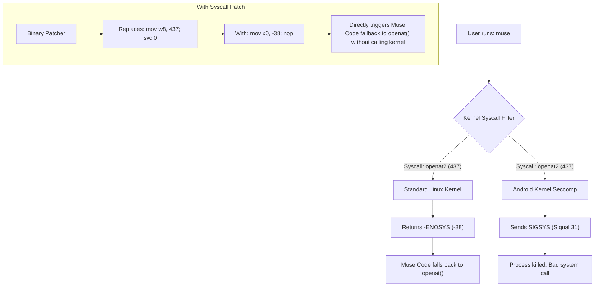

<div align="center">

# Muse Code

**Run Meta's Muse Code (`muse`) natively inside Android Termux without root.**

[](LICENSE)
[](https://termux.dev)
[](https://en.wikipedia.org/wiki/AArch64)
[](https://dev.meta.ai/products/muse-code)

[Features](#key-features) •
[Quick Install](#quick-install) •
[Technical Overview](#technical-overview) •
[Usage Guide](#usage-guide) •
[Troubleshooting](#troubleshooting)

</div>

---

> [!NOTE]
> **Muse Code** (`muse`) is a terminal coding agent developed by Meta. Because its official distribution targets standard Linux distributions, executing it directly inside Termux on Android encounters kernel-level seccomp halts (`Bad system call`) and root filesystem permission barriers (`IoError`). This project provides an automated binary patcher and runtime environment allowing Muse Code to run on Android without root privileges.

---

## Quick Install

Paste and run the following command in your Termux terminal:

```bash
curl -sSL https://raw.githubusercontent.com/itswill00/museai-termux/main/install.sh | bash
```

### Install from Source

```bash
git clone https://github.com/itswill00/museai-termux.git
cd museai-termux
bash install.sh
```

---

## Key Features

- [x] **Zero Root Required**: Runs entirely in user-space inside standard Termux.
- [x] **Automated Binary Patching**: Neutralizes Android's blocked `openat2` syscall (`SIGSYS` / `Bad system call`) directly in the statically linked AArch64 ELF binary.
- [x] **Chroot Virtualization Layer**: Integrates `termux-chroot` (PRoot) automatically to provide the traditional Linux `/etc` and `/` filesystem hierarchy expected by capability-based security runtimes.
- [x] **Auto-Patcher on Updates**: The wrapper script automatically re-patches new binaries on-the-fly whenever Muse Code downloads an official background update.
- [x] **Pre-configured Workspace Trust**: Sets up `.config/muse/trust.json` so you can launch Muse Code in any directory without trust errors.
- [x] **Full Interactive TUI & Headless Exec**: Supports both the rich interactive terminal UI and non-interactive scripted prompts (`muse exec`).

---

## Technical Overview

When running the official Muse Code build on Android Termux, two fatal hurdles occur:



### Syscall Seccomp Trap (Bad system call)
- **Root Cause**: The binary uses modern Rust capability libraries that attempt the `openat2(2)` system call (`__NR_openat2` = 437).
- **The Catch**: On Android kernels, the zygote/app seccomp-bpf filter disallows `openat2` and sends **`SIGSYS`** instead of returning `-ENOSYS`.
- **The Fix**: `patch-binary.py` replaces the assembly pattern `mov w8, #0x1b5; svc #0` with `mov x0, #-38; nop`. When Muse Code executes this code, it reads the simulated `-ENOSYS` error code in `x0` and immediately branches to its built-in fallback using standard `openat(2)`.

### Android Root Permission Barrier (IoError)
- **Root Cause**: Muse Code walks directory trees and inspects `/` to discover system agent definitions and `/etc` configuration files. On Android, `/` has `0700` (`drwx------ root root`) permissions, causing `openat(AT_FDCWD, "/", ...)` to return `EACCES (Permission denied)`, resulting in `Agent Definition filesystem source failed: IoError`.
- **The Fix**: The launcher wraps execution with `termux-chroot` (PRoot), creating a traditional Linux filesystem hierarchy where `/`, `/usr`, and `/etc` are world-readable.

---

## Usage Guide

### Interactive Mode
Simply run:
```bash
muse
```
This opens the full interactive terminal user interface.

### Meta Account Authentication
Authenticate with your Meta / AI credentials:
```bash
muse login
```
Follow the URL prompt in your browser to approve your device.

> [!TIP]
> You can also supply your Meta API key via environment variable:
> ```bash
> export META_API_KEY="your_api_key_here"
> ```

### Headless Execution
Run prompts directly from the command line:
```bash
# Test with built-in echo provider
muse exec --provider echo "Hello from Termux!"

# Run code assistance headlessly
muse exec "Write a python script that checks device battery in Termux"
```

### Healthcheck and Verification
Run the included verification suite at any time:
```bash
bash ~/museai-termux/scripts/verify.sh
```

---

## Repository Structure

```
museai-termux/
├── install.sh                  # One-click automated installer & patcher
├── LICENSE                     # MIT License
├── README.md                   # Comprehensive documentation
├── .gitignore                  # Git ignore rules
└── scripts/
    ├── patch-binary.py         # Standalone AArch64 syscall patcher
    ├── setup-environment.sh    # Workspace trust and shell profile setup
    └── verify.sh               # Post-install verification test suite
```

---

## Troubleshooting

<details>
<summary><b>Muse Code gives "Bad system call" after an automatic update</b></summary>

The wrapper launcher at `~/.local/bin/muse` is designed to auto-patch new binaries automatically. If you ever need to manually re-patch:
```bash
python3 ~/museai-termux/scripts/patch-binary.py
```
</details>

<details>
<summary><b>Error: "failed to resolve project root for trust"</b></summary>

Inside `termux-chroot`, Termux maps `$HOME` to `/home`. Ensure your `~/.config/muse/trust.json` includes `/home`:
```bash
bash ~/museai-termux/scripts/setup-environment.sh
```
</details>

<details>
<summary><b>How to completely uninstall Muse Code</b></summary>

Run the following commands:
```bash
rm -rf ~/.local/bin/muse* ~/.config/muse ~/.local/share/muse
```
</details>

---

## Author & Credits

- **Author / Porter**: [itswill00](https://github.com/itswill00) (<anstykx00@gmail.com>)
- **Upstream Agent**: [Muse Code](https://dev.meta.ai/products/muse-code) by Meta Platforms, Inc.

---

## License

This project is licensed under the [MIT License](LICENSE).
